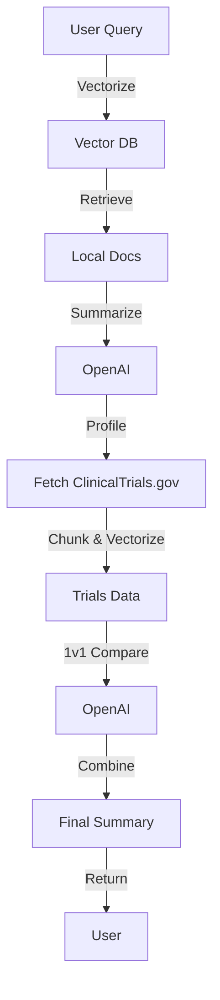

# 🧬 Benchmark Comparison API: The Ultimate Clinical Trials Showdown 🧬


> _"Because your clinical trial data deserves to FIGHT for its place in the sun!"_

---

## 🚀 What is this?

Welcome to the **Benchmark Comparison API** – the FastAPI-powered, OpenAI-fueled, GCP-enabled, RAG-ified, vectorized, and _absolutely over-engineered_ solution for comparing your local clinical trial data with the best (and worst) that ClinicalTrials.gov has to offer. 

If you ever wanted to:
- **Flex** your local research against the FDA's finest
- **Automate** the most tedious literature review ever
- **Summon** GPT-4/5 to roast or praise your study
- **Feel** like a data wizard

...then you, my friend, are in the right repo.

---

## 🏗️ Project Structure (aka "Where the Magic Happens")

| Folder/File | What It Does |
|-------------|-------------|
| `benchmark_comparison_api.py` | The FastAPI app. The bouncer at the club. |
| `main.py` | The brains. All the RAG, vector, and OpenAI logic. |
| `src/` | All the modules for chunking, vectorizing, fetching, and more. |
| `requirements.txt` | The shopping list for your Python environment. |
| `service_account_credentials.json` | Your GCP keys. (DO NOT COMMIT! Or the Google police will find you.) |
| `gcp-indexes/` | Where your downloaded indexes live. |
| `prompt.py` | Prompt engineering, because LLMs are needy. |

---

## 🛠️ Setup: The "Don't Skip This" Section

### 1. Clone the Repo

```bash
git clone https://github.com/YOUR_USERNAME/benchmark-comparison-api.git
cd benchmark-comparison-api
```

### 2. Create Your Python Environment

> _"If you run this in base, a conda fairy loses its wings."_

```bash
conda create -n pranav-medical-agent python=3.11 -y
conda activate pranav-medical-agent
pip install -r requirements.txt
```

### 3. Get Your OpenAI API Key

- Go to [OpenAI](https://platform.openai.com/account/api-keys)
- Copy your key
- Create a `.env` file:

```bash
echo "OPENAI_API_KEY=sk-..." > .env
```

### 4. GCP Service Account Credentials

- Go to your GCP console, create a service account, and download the JSON key.
- Place it in the root as `service_account_credentials.json` (and **never** commit it, unless you want to sponsor a botnet).

### 5. (Optional) Set Your Model

- By default, it uses `gpt-5-2025-08-07` (because why not?).
- To change, add to `.env`:

```bash
MODEL_ID_GPT5=gpt-4
```

---

## 🏃‍♂️ Running the API (Like a Boss)

### The Right Way™️

From the parent directory (not inside the `benchmark_comparison` folder!):

```bash
uvicorn benchmark_comparison.benchmark_comparison_api:app --port 8091 --reload
```

### The Wrong Way (Don't Do This)

```bash
python benchmark_comparison_api.py
# Or worse...
python -m benchmark_comparison_api
```

> _"If you see 'No module named benchmark_comparison', you did it wrong. Go up a directory!"_

---

## 🧪 Example Request

```bash
curl -X POST "http://localhost:8091/benchmark_comparison/query" \
     -H "Content-Type: application/json" \
     -d '{"query": "What is the efficacy of Drug X in treating Y?", "model_id": "medical_papers"}'
```

---

## 🩺 What Does It Actually Do?

1. **Vectorizes** your question
2. **Finds** the most relevant local docs
3. **Summons** OpenAI to summarize your study
4. **Fetches** matching clinical trials from ClinicalTrials.gov
5. **Compares** your study to each fetched trial (1v1, like Pokémon battles)
6. **Combines** all the results into a final, glorious summary

---

## 🖼️ Screenshots & Diagrams

### API Flow




---

## 🛡️ Security & .gitignore

- `.env` and `service_account_credentials.json` are **NOT** committed. You must add your own.
- If you commit your keys, the repo will be haunted by the ghost of InfoSec Past.

---

## 🧙‍♂️ Troubleshooting (aka "Why is it broken?")

| Problem | Solution |
|---------|----------|
| `No module named 'benchmark_comparison'` | Run from the parent directory! |
| `OpenAI API key not found` | Add it to `.env` or your environment. |
| `Failed to download index` | Check your GCP credentials and bucket. |
| `Error: ...` | Read the logs. They're funnier than you think. |

---

## 🤖 Contributing

PRs welcome! But only if you bring memes.

---

## 📜 License

MIT. Because lawyers need to eat too.

---

## 💬 Final Words

> _"If you made it this far, you probably know more about clinical trials than your average AI. Go forth and benchmark!"_

---


